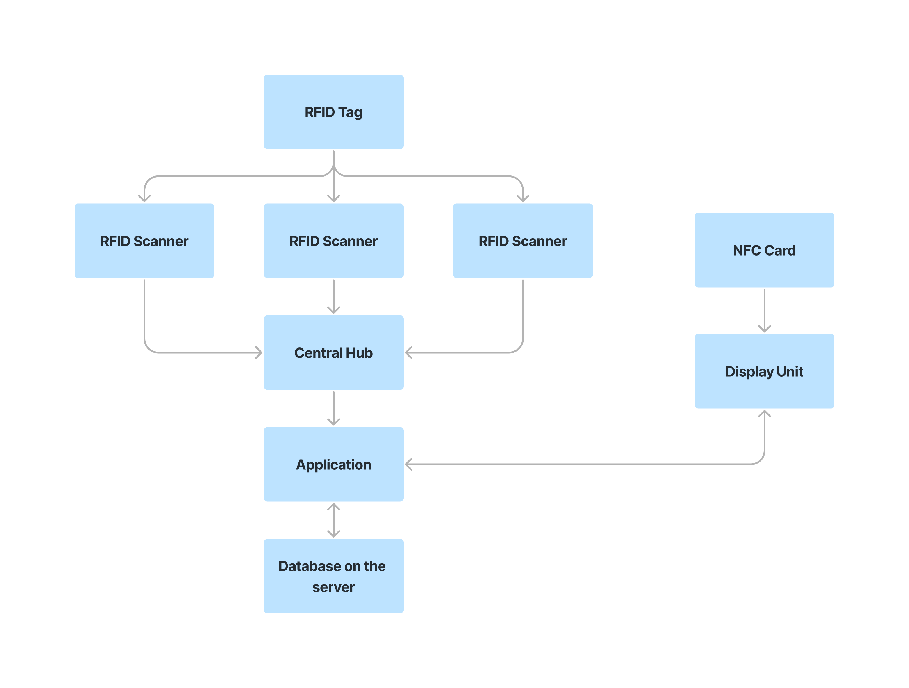

# Event Attendance Management System

---

<!--
This is a sample image, to show how to add images to your page. To learn more options, please refer [this](https://projects.ce.pdn.ac.lk/docs/faq/how-to-add-an-image/)

 -->

## Team

- E/19/003, Abeysinghe A.M.H.P., [email](e19003@eng.pdn.ac.lk)
- E/19/028, A.N.I.Atugedara, [email](e19028@eng.pdn.ac.lk)
- E/19/167, H.D.N.S.Jayawardena, [email](e19167@eng.pdn.ac.lk)
- E/19/240, B.M.S.Mendis, [email](e19240@eng.pdn.ac.lk)
- E/19/431, I.W.A.P.D.Wickramaarachchi, [email](e19431@eng.pdn.ac.lk)

## Table of Contents

1. [Introduction](#introduction)
2. [Control & Data Flow](#control-&-data-flow)
3. [Key Featuers](#key-featuers)
4. [User Experince](#user-experince)
5. [Links](#links)

---

## Introduction

This project is dedicated to simplifying and enhancing the process of tracking attendance and session participation for registered event attendees. Whether you are organizing conferences, workshops, or any other type of gathering, our solution provides a robust and user-friendly platform to efficiently manage and monitor participant engagement.

## Control & Data Flow

### Data Flow

> 

   

## User Experince

## Links

- [Project Repository](https://github.com/cepdnaclk/e19-3yp-Event-Attendance-Management-System)
- [Project Page](https://cepdnaclk.github.io/e19-3yp-Event-Attendance-Management-System/)
- [Department of Computer Engineering](http://www.ce.pdn.ac.lk/)
- [University of Peradeniya](https://eng.pdn.ac.lk/)

[//]: # "Please refer this to learn more about Markdown syntax"
[//]: # "https://github.com/adam-p/markdown-here/wiki/Markdown-Cheatsheet"
