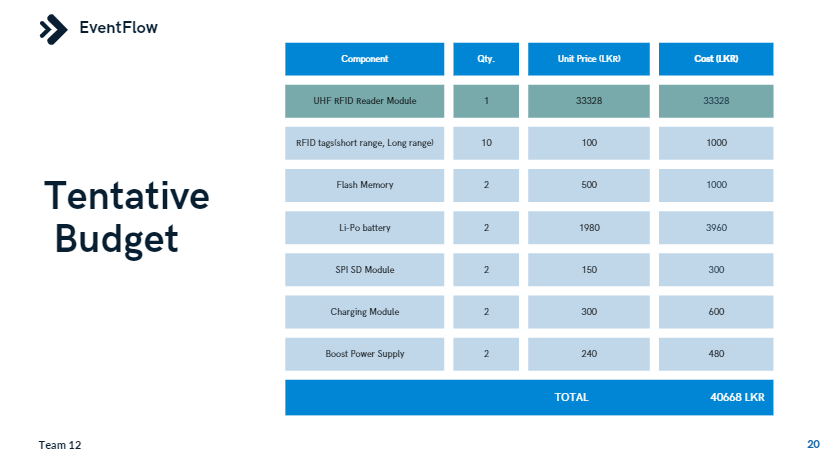

[comment]: # "This is the standard layout for the project, but you can clean this and use your own template"

# Event-Attendance-Management-System

---

## Team

- E/19/004 [email](e19003@eng.pdn.ac.lk) [R.B.Abeysinghe](https://github.com/RavinduBA) 
- E/19/028 [email](e19028@eng.pdn.ac.lk) [A.N.I.Atugedara](https://github.com/NilakshiInduwara)  
- E/19/167 [email](e19167@eng.pdn.ac.lk) [H.D.N.S.Jayawardena](https://github.com/sath8) 
- E/19/240 [email](e19240@eng.pdn.ac.lk) [B.M.S.Mendis](https://github.com/Shenal-M) 
- E/19/431 [email](e19431@eng.pdn.ac.lk) [I.W.A.P.D.Wickramaarachchi](https://github.com/Prageeth-Dananjaya)

<!-- Image (photo/drawing of the final hardware) should be here -->

<!-- This is a sample image, to show how to add images to your page. To learn more options, please refer [this](https://projects.ce.pdn.ac.lk/docs/faq/how-to-add-an-image/) -->

<!--  -->

#### Table of Contents

1. [Introduction](#introduction)
2. [Solution Architecture](#solution-architecture)
3. [Hardware & Software Designs](#hardware-and-software-designs)
4. [Testing](#testing)
5. [Detailed budget](#detailed-budget)
6. [Conclusion](#conclusion)
7. [Links](#links)

## Introduction

This project is dedicated to simplifying and enhancing the process of tracking attendance and session participation for registered event attendees. Whether you are organizing conferences, workshops, or any other type of gathering, our solution provides a robust and user-friendly platform to efficiently manage and monitor participant engagement.

<iframe width="560" height="315" src="https://www.youtube.com/embed/6XMMViNymo0?si=cfR05esrMx-4IZQ-" title="YouTube video player" frameborder="0" allow="accelerometer; autoplay; clipboard-write; encrypted-media; gyroscope; picture-in-picture; web-share" allowfullscreen></iframe>

## Solution Architecture

Design Flow
> 

High Level dArchitecture
> 

Cloud Architecture
> 

## Hardware and Software Designs

Detailed designs with many sub-sections

## Testing

Testing is done on hardware and software.

#### Software Testing Strategy for Reliable Event Management System

Our project utilizes a comprehensive testing strategy to ensure the reliability and performance of the event attendance management software. This includes:

Unit Testing: Identifies and fixes bugs within individual units before integration, ensuring fundamental functionalities work as intended. This minimizes the likelihood of unexpected issues arising during live events.

Integration Testing: Verifies seamless communication between various components of the system, including user registration, session management, RFID/NFC data processing, and dashboards. This ensures smooth data flow and prevents compatibility issues.

End-to-End Testing: Simulates user journeys from registration to attendance tracking and data analysis. This identifies hidden issues with user flows and functionalities, guaranteeing a seamless user experience.

Performance Testing: Evaluates system scalability under high load conditions, simulating large numbers of attendees and concurrent sessions. This ensures the system can handle peak demands without compromising responsiveness.

Cross-Browser Testing: Validates the application's functionality across various browsers and devices. This identifies browser-specific bugs and compatibility issues, ensuring widespread accessibility and consistent user experience.

By implementing this comprehensive testing strategy, we aim to deliver a robust and user-friendly event management platform that guarantees a successful and enjoyable event experience for everyone involved.

## Detailed budget

> 

## Conclusion

What was achieved, future developments, commercialization plans

## Links

- [Project Repository](https://github.com/cepdnaclk/e19-3yp-Event-Attendance-Management-System)
- [Project Page](https://cepdnaclk.github.io/e19-3yp-Event-Attendance-Management-System/)
- [Department of Computer Engineering](http://www.ce.pdn.ac.lk/)
- [University of Peradeniya](https://eng.pdn.ac.lk/)

[//]: # "Please refer this to learn more about Markdown syntax"
[//]: # "https://github.com/adam-p/markdown-here/wiki/Markdown-Cheatsheet"
